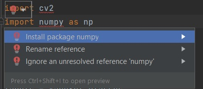

# Realtime Emojifier

Abstract
-------------------
This project represents a real-time emotion detector based on python 3.8 with pre-trained face detector model.
Program uses laptop/dekstop webcam to detect and analyze the facial expressions and classifies them into 7 categories: anger, disgust, fear, happiness, neutral, sadness, surprise. 
It also shows a percentage of how close the input image is to each emotion category.
For the training of model we used FER-2013 Dataset, which consists of 48x48 pixel grayscale images of faces.

This project helps to understand the basics of machine learning and deep learning.
## Requirements: 
1. Python 3.8 or latest,
2. Webcam, 
3. Installed OpenCV, Tkinter,PyTorch, Pillow.

## Installation: 
1. Install required libraries: 
   Open terminal and enter the following command:
   * ```pip install numpy```
   * ```pip install torch```
   * ```pip install torchvision```
   * ```pip install opencv-python```
   * ```pip install pillow```
   * ```pip install tk```
   
Or if you work on PyCharm IDE:

 1. We can see that some libraries fails in our program.
Choose the option: Install package 'package_name'

    

2. At the bottom of the screen on the right side you will see an installation process. 


 

3. A short time afterwards the requested library will be installed.
   

4. Then make sure your webcam is working correctly,
5. Run "main.py".
   
Video demonstration: 


